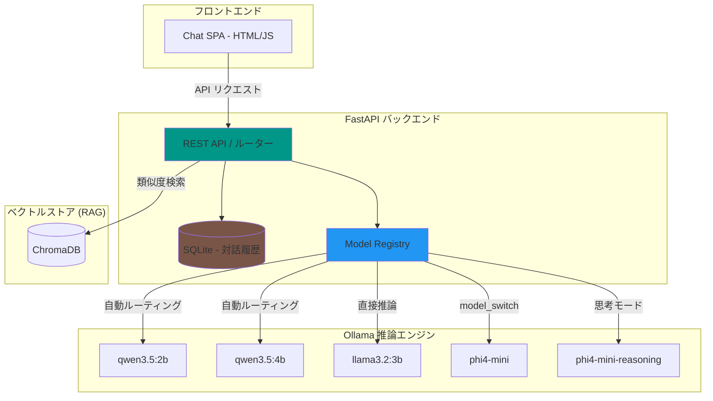

<div align="center">

  <samp>ローカルAI。スマートルーティング。あなたのナレッジ。</samp>
  <br><br>

  <a href="https://github.com/mile-chang/rag-kura">
    
  </a>

</div>

> Ollama を活用した、動的モデルルーティング・機能ガード・マルチモデル対応のローカルファースト RAG ナレッジアシスタント。

[](https://www.python.org/downloads/)
[](https://fastapi.tiangolo.com/)
[](https://ollama.com/)
[](https://opensource.org/licenses/MIT)

[English](README.md) | [繁體中文](README.zh-TW.md)

---

## 概要

RAG-Kura は、FastAPI と Ollama で構築されたローカルファーストのナレッジアシスタントバックエンドです。**モデルレジストリ（Model Registry）** によるインテリジェントなリクエストルーティングを実現し、適切なモデルバリアントの自動選択、パラメータ注入、非対応機能の自動ブロックを手動操作なしで行います。

## 主な機能

- **検索拡張生成 (RAG)** — ChromaDBを統合し、ローカルドキュメントの知識に基づいて質問に応答。
- **モダンなチャット UI (SPA)** — HTML/CSS/JS で構築されたレスポンシブなシングルページアプリケーション。
- **生成の中断/停止** — モデルの回答を即座に停止し、ユーザーのコントロール性を向上。
- **動的推論トグル (思考モード)** — 推論モデル向けに `parameter` と `model_switch` 戦略をサポート。
- **スマートなロード UI** — モデルの VRAM 状態をリアルタイムで検知し、ロード中のインジケーターを表示。
- **対話の永続化** — SQLite による履歴保存、タイトルの自動生成および手動編集に対応。
- **モデルレジストリ** — 全登録モデルの機能を一元管理し、最適なルーティングを実現。
- **セキュリティ & 機能ガード** — 非対応機能（テキスト専用モデルへの画像送信など）のリクエストを自動的にブロック。

## システムアーキテクチャ



## 登録済みモデル (Ollama)

各モデルの推論特性に合わせた最適化設定：

| モデル | 推論戦略 | 備考 |
|--------|----------|------|
| [**qwen3.5:2b**](https://ollama.com/library/qwen3.5) | `parameter` | パラメータ注入により `Think` モード切替に対応 |
| [**qwen3.5:4b**](https://ollama.com/library/qwen3.5) | `parameter` | 同上 |
| [**llama3.2:3b**](https://ollama.com/library/llama3.2) | `none` | 標準的な対話モデル、推論切替なし |
| [**phi4-mini**](https://ollama.com/library/phi4-mini) | `model_switch` | 推論時に `phi4-mini-reasoning` へ自動切り替え |

## 前提条件

- Python 3.12+
- [**Ollama**](https://ollama.com/) インストール済み、必要なモデルをプル済み
- **PyTorch (CPU 版)**：デフォルトで CPU を使用し、Ollama 用の VRAM を節約します。VRAM に余裕がある場合は、GPU 版のインストールも可能です。

## ローカル開発

```bash
# クローンとセットアップ
git clone https://github.com/mile-chang/rag-kura.git
cd rag-kura

# 環境構築
python3 -m venv .venv
source .venv/bin/activate

# 💡 リソース計画：デフォルトで CPU 版 PyTorch をインストールして VRAM を節約します。十分なリソースがある場合は、この行をスキップして直接 install -r を実行できます。
pip install torch --index-url https://download.pytorch.org/whl/cpu
pip install -r requirements.txt

# ナレッジの取り込み（オプション）
# Markdown ファイルを docs/ に配置し、以下を実行：
python ingest.py

# サーバー起動
uvicorn main:app --reload --host 0.0.0.0 --port 8000
# ブラウザで開く: http://localhost:8000
```

## ロードマップ (Roadmap)

- [x] Phase 1: 環境構築と SSD 容量の最適化
- [x] Phase 2: AI バックエンド基盤の構築 (FastAPI & Ollama)
- [x] Phase 3: ベクトルデータベースとドキュメント処理 (ローカル ChromaDB)
- [x] Phase 4: RAG コアロジックの統合 (検索・生成)
- [x] Phase 5: モダンなチャット UI (カスタム SPA 実装)
- [ ] Phase 6: コンテナ化と自動デプロイ (Docker Compose)

詳細なタスクについては `TODO.md` をご参照ください。

## API エンドポイント (RESTful)

| メソッド | エンドポイント | 説明 |
|----------|---------------|------|
| GET | `/api/conversations` | 對話一覧の取得 |
| POST | `/api/conversations` | 新規対話の作成 |
| GET | `/api/conversations/{id}` | 對話履歴の取得 |
| DELETE | `/api/conversations/{id}` | 對話の削除 |
| PATCH | `/api/conversations/{id}/title` | 對話タイトルの更新 |
| POST | `/api/conversations/{id}/messages` | メッセージ送信（モデル/推論指定可） |
| GET | `/api/models/check_loaded` | モデルが VRAM にロードされているか確認 |

## プロジェクト構成

```
rag-kura/
├── main.py              # FastAPI コア & 転送ルーティング
├── database.py          # SQLite 永続化ロジック
├── chat_history.db      # SQLite データベース（無視対象）
├── ingest.py            # ナレッジ取り込みスクリプト
├── prompts.py           # システムプロンプトテンプレート
├── tools.py             # 外部ツールの定義
├── static/              # フロントエンド（index.html, script.js）
├── docs/                # ナレッジソースディレクトリ
├── chroma_db/           # ChromaDB ベクトルストア（無視対象）
├── requirements.txt     # Python 依存パッケージ
├── README.ja.md         # 日本語ドキュメント
└── TODO.md              # プロジェクトロードマップ
```

## 技術スタック

| 分類 | 技術 / モデル | 説明 |
|------|--------------|------|
| **チャット UI** | Vanilla JS, Tailwind CSS | モダンな SPA、生成の中断と履歴保存に対応 |
| **バックエンド核心** | FastAPI, SQLite | 非同期推論、動的ルーティング、永続化に対応 |
| **知識検索 (RAG)** | LangChain, ChromaDB | ローカルベクトルストア、Markdown 形式に対応 |
| **埋め込みモデル** | [**bge-small-zh-v1.5**](https://huggingface.co/BAAI/bge-small-zh-v1.5) | **CPU 実行**、SOTA 中文埋め込み技術、VRAM 節約 |
| **推論エンジン** | [**Ollama**](https://ollama.com/) | ローカル LLM ランタイム (GPU 推論対応) |

## セキュリティ

- `X-Client-ID` ヘッダーによるブラウザレベルの分離。
- タイトル文字数制限（100文字）とバックエンドでのサニタイズ。
- アップロード関連の不正パスアクセス防止。

## ライセンス

本プロジェクトは MIT ライセンスの下で公開されています — 詳細は [LICENSE](LICENSE) ファイルをご覧ください。
