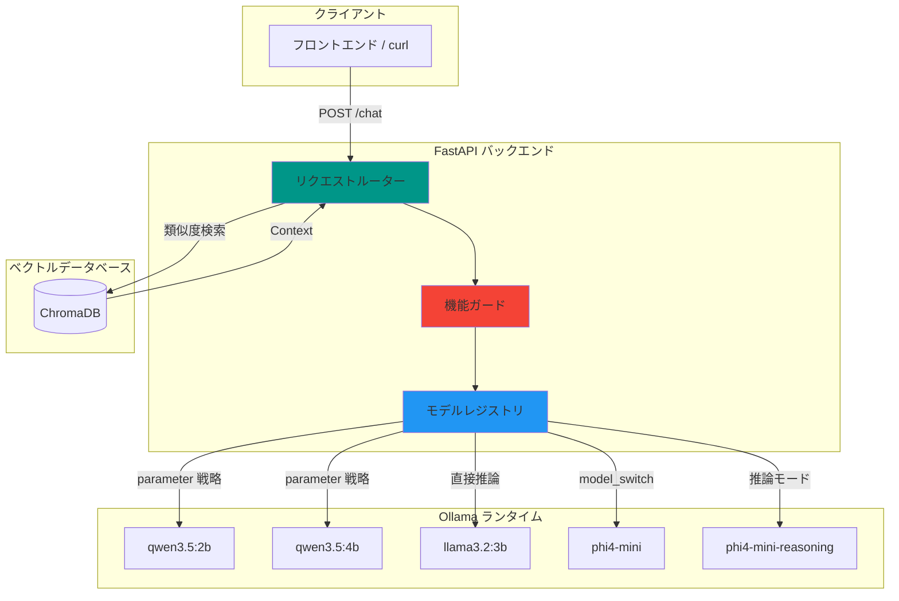

<div align="center">

  <samp>ローカルAI。スマートルーティング。あなたのナレッジ。</samp>
  <br><br>

  

</div>

> Ollama を活用した、動的モデルルーティング・機能ガード・マルチモデル対応のローカルファースト RAG ナレッジアシスタント。

[](https://www.python.org/downloads/)
[](https://fastapi.tiangolo.com/)
[](https://ollama.com/)
[](https://opensource.org/licenses/MIT)

[English](README.md) | [繁體中文](README.zh-TW.md)

---

## 概要

RAG-Kura は、FastAPI と Ollama で構築されたローカルファーストのナレッジアシスタントバックエンドです。**モデルレジストリ（Model Registry）** によるインテリジェントなリクエストルーティングを実現し、適切なモデルバリアントの自動選択、パラメータ注入、非対応機能の自動ブロックを手動操作なしで行います。

## 主な機能

- **検索拡張生成（RAG）** — ChromaDBを統合し、ローカルドキュメントの知識に基づいて質問に応答
- **モデルレジストリ** — 全登録モデルの機能を一元宣言
- **ビジョンガード** — 画像リクエストをテキスト専用モデルに送信した場合、自動拒否（HTTP 400）
- **動的推論トグル** — 思考連鎖の制御に2つの戦略を提供：
  - `parameter` — ストップトークン注入で `<think>` ブロックを抑制
  - `model_switch` — 実行時に専用推論モデルへ切り替え
- **ローカルファースト** — 推論とエンベディングはすべてローカルで実行され、クラウド API は不要
- **拡張容易** — モデル追加は辞書を1つ編集するだけ

## システムアーキテクチャ



## 登録済みモデル

| モデル | ビジョン | 推論戦略 | 備考 |
|--------|----------|----------|------|
| `qwen3.5:2b` | ✅ | `parameter` | ストップトークンで `<think>` を制御 |
| `qwen3.5:4b` | ✅ | `parameter` | 同上（デフォルトモデル） |
| `llama3.2:3b` | ❌ | `none` | 推論トグルなし |
| `phi4-mini` | ❌ | `model_switch` | `phi4-mini-reasoning` に切り替え |

## 前提条件

- Python 3.12+
- [Ollama](https://ollama.com/) インストール済み、必要なモデルをプル済み

## ローカル開発

```bash
# クローンとセットアップ
git clone https://github.com/mile-chang/rag-kura.git
cd rag-kura

# 仮想環境の作成と依存パッケージのインストール
python3 -m venv .venv
source .venv/bin/activate
pip install -r requirements.txt

# ナレッジベースのインジェスト（オプション）
# Markdown ファイルを docs/ ディレクトリに配置し、以下を実行：
python ingest.py

# サーバー起動
uvicorn main:app --reload --host 0.0.0.0 --port 8000
# → http://localhost:8000
```

## デプロイ

> 近日公開予定。

## ロードマップ (Roadmap)

- [x] Phase 1: 環境構築とSSD容量の最適化
- [x] Phase 2: AIバックエンド基盤の構築 (FastAPI & Ollama)
- [x] Phase 3: ベクトルデータベースとドキュメント処理 (ローカル ChromaDB)
- [x] Phase 4: RAGコアロジックの統合 (検索・生成)
- [ ] Phase 5: Streamlit フロントエンド対話インターフェース
- [ ] Phase 6: コンテナ化と自動デプロイ (Docker Compose, CI/CD)

詳細なタスクについては `TODO.md` をご参照ください。

## API エンドポイント

| メソッド | エンドポイント | 説明 |
|----------|---------------|------|
| POST | `/chat` | モデル選択・推論モード切替付きメッセージ送信 |
| GET | `/health` | ヘルスチェック、登録モデル一覧を返却 |

### リクエスト形式

```json
{
  "message": "RAGとは何ですか？",
  "base_model": "qwen3.5:4b",
  "use_reasoning": false,
  "has_image": false
}
```

### レスポンス形式

```json
{
  "model": "qwen3.5:4b",
  "response": "RAGは検索拡張生成の略で..."
}
```

### 使用例：curl

```bash
# 基本チャット
curl -X POST http://localhost:8000/chat \
  -H "Content-Type: application/json" \
  -d '{"message": "こんにちは、あなたは誰ですか？"}'

# 推論モード有効化
curl -X POST http://localhost:8000/chat \
  -H "Content-Type: application/json" \
  -d '{"message": "量子コンピューティングを説明してください", "use_reasoning": true}'

# ヘルスチェック
curl http://localhost:8000/health
```

## プロジェクト構成

```
rag-kura/
├── main.py              # FastAPI アプリ（ルーティングと機能ガード）
├── ingest.py            # ナレッジ取り込みスクリプト（Markdown -> ChromaDB）
├── prompts.py           # システムプロンプトテンプレート
├── tools.py             # 外部ツールの定義（Web検索、天気など）
├── docs/                # 取り込み対象のMarkdownファイル用ディレクトリ
├── chroma_db/           # ChromaDB ベクトルストア（バージョン管理対象外）
├── requirements.txt     # バージョン固定の Python 依存パッケージ
├── .gitignore           # セキュリティ重視の除外ルール
├── .venv/               # 仮想環境（バージョン管理対象外）
├── README.md            # ドキュメント（English）
├── README.zh-TW.md      # ドキュメント（繁體中文）
└── README.ja.md         # ドキュメント（日本語）
```

## 技術スタック

| レイヤー | 技術 |
|----------|------|
| バックエンド | FastAPI, Pydantic, Uvicorn |
| RAG | LangChain, HuggingFaceEmbeddings, ChromaDB |
| 推論 | Ollama（ローカル LLM ランタイム） |
| モデル | Qwen 3.5, LLaMA 3.2, Phi-4 Mini, bge-small-zh-v1.5 |

## セキュリティ

- `.env` による環境シークレット管理（バージョン管理対象外）
- データベースファイルをバージョン管理から除外（`*.db`, `*.sqlite`）
- SSL 証明書と秘密鍵を除外（`*.pem`, `*.key`）
- アップロードディレクトリを除外し、機密データの漏洩を防止

## ライセンス

本プロジェクトは MIT ライセンスの下で公開されています — 詳細は [LICENSE](LICENSE) ファイルをご覧ください。
