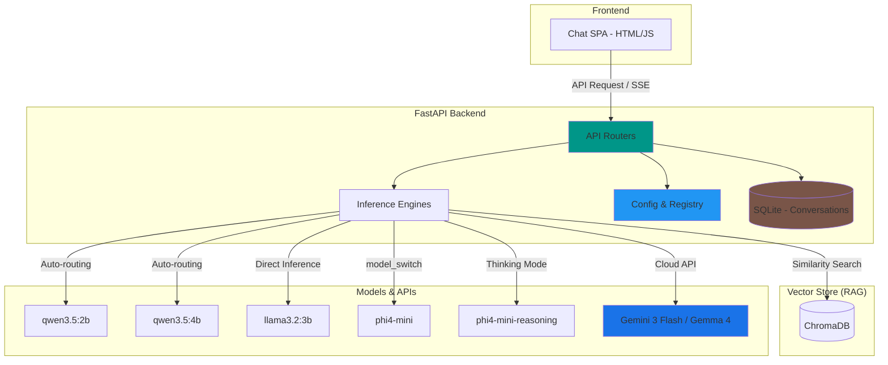

<div align="center">

  <samp>Local AI. Smart Routing. Your Knowledge.</samp>
  <br><br>
  <a href="https://github.com/mile-chang/rag-kura">
    
  </a>
</div>

> A hybrid RAG knowledge assistant with dynamic model routing, capability guards, and multi-provider support — powered by Ollama and Google Gemini.

[](https://www.python.org/downloads/)
[](https://fastapi.tiangolo.com/)
[](https://ollama.com/)
[](https://aistudio.google.com/)
[](https://opensource.org/licenses/MIT)

[繁體中文](README.zh-TW.md) | [日本語](README.ja.md)

---

## Overview

RAG-Kura is a knowledge assistant backend built with FastAPI, Ollama, and Google Gemini. It features a **Model Registry** that enables intelligent request routing — automatically selecting the right model variant from local or cloud providers, injecting parameters, and guarding against unsupported capabilities — all without manual intervention.

## Key Features

- **Hybrid AI Routing**: Seamlessly switch between Local (Ollama) and Cloud (Google Gemini) models with automatic capability guards.
- **Retrieval-Augmented Generation (RAG)**: Chat with your local documents using CPU-efficient embeddings and ChromaDB.
- **Dynamic Reasoning (Thinking Mode)**: Built-in support for model reasoning parameters with a beautifully collapsible `<think>` block UI.
- **Seamless Guest Experience**: Start chatting immediately. Guest sessions are auto-saved locally and safely merged upon registration (with GC protection).
- **Responsive Modern SPA**: A lightweight, Tailwind-powered interface with a smooth collapsible icon-only sidebar and mobile auto-hide.
- **Real-time Streaming & Tool Calling**: Fast Server-Sent Events (SSE) streaming with integrated web search and utility tools.

## System Architecture



## Supported Providers & Models

RAG-Kura provides an abstraction layer capable of supporting both Local (Ollama) and Cloud (Gemini) backends:

### Local (Ollama)
| Model | Strategy | Notes |
|-------|----------|-------|
| [**qwen3.5:2b**](https://ollama.com/library/qwen3.5) | `parameter` | Supports `Think` mode via parameter injection |
| [**qwen3.5:4b**](https://ollama.com/library/qwen3.5) | `parameter` | Same as above |
| [**llama3.2:3b**](https://ollama.com/library/llama3.2) | `none` | Standard chat, no reasoning toggle |
| [**phi4-mini**](https://ollama.com/library/phi4-mini) | `model_switch` | Swaps to `phi4-mini-reasoning` during inference |

### Cloud (Google Gemini)
| Model | Strategy | Notes |
|-------|----------|-------|
| **Gemini 3 Flash** | `thinking_level` | High-speed cloud routing with reasoning support |
| **Gemma 4 31B** | `thinking_level_optional` | Large reasoning model via Gemini API |

## Prerequisites

- Python 3.12+
- [**Ollama**](https://ollama.com/) installed with required models pulled (optional if running purely on Gemini).
- [**Google Gemini API Key**](https://aistudio.google.com/apikey) (optional if running purely on local Ollama).
- **PyTorch (CPU version)**: Defaults to CPU to save VRAM for Ollama; if you have sufficient VRAM, you may install the GPU version.

## Local Development

```bash
# Clone and setup
git clone https://github.com/mile-chang/rag-kura.git
cd rag-kura

# Setup surroundings
python3 -m venv .venv
source .venv/bin/activate

# 💡 Resource Planning: Defaults to CPU-only PyTorch to save VRAM. If your hardware is sufficient, skip this line and install via -r directly.
pip install torch --index-url https://download.pytorch.org/whl/cpu
pip install -r requirements.txt

# Environment Setup
cp .env.example .env
# Edit .env to set your GEMINI_API_KEY (for cloud models) and JWT_SECRET_KEY (for authentication)

# Ingest Knowledge (Optional)
# Place Markdown files in docs/, then run:
python ingest.py

# Start the server
uvicorn main:app --reload --host 0.0.0.0 --port 8000
# Open browser at: http://localhost:8000
```

## Roadmap

- [x] Phase 1: Environment Setup & SSD Optimization
- [x] Phase 2: AI Backend Foundation (FastAPI & Ollama)
- [x] Phase 3: Vector Database & Document Processing (Local ChromaDB)
- [x] Phase 4: RAG Core Logic Integration (Retriever & Generator)
- [x] Phase 5: Modern Chat GUI (Custom SPA implementation)
- [ ] Phase 6: Containerization & Deployment (Docker Compose)

Detailed tasks are in `TODO.md`.

## API Endpoints (RESTful)

| Method | Endpoint | Description |
|--------|----------|-------------|
| POST | `/api/users` | Register a new user account |
| POST | `/api/sessions` | Login and issue JWT (merges anonymous history) |
| GET | `/api/users/me` | Get currently authenticated user profile |
| GET | `/api/conversations` | List all conversations |
| POST | `/api/conversations` | Create a new session |
| GET | `/api/conversations/{id}`| Get session history |
| DELETE | `/api/conversations/{id}`| Delete a session |
| PATCH | `/api/conversations/{id}/title` | Update session title |
| POST | `/api/conversations/{id}/messages`| Send message (with model/reasoning) |
| POST | `/api/upload` | Upload knowledge base document |
| GET | `/api/models/{id}/status` | Check if model is in VRAM / loaded |
| GET | `/api/status` | List provider availability (Ollama/Gemini) |

## Project Structure

```
rag-kura/
├── main.py              # Entry point & static mount
├── config.py            # App configuration & Model registry
├── schemas.py           # Pydantic data models
├── api/                 # FastAPI HTTP route handlers
├── inference/           # Inference engines & generators
├── database.py          # SQLite persistence layer
├── chat_history.db      # SQLite database (gitignored)
├── ingest.py            # Knowledge ingestion script
├── prompts.py           # System prompt templates
├── tools.py             # External tool definitions
├── static/              # Frontend (index.html, script.js)
├── docs/                # Knowledge source directory
├── chroma_db/           # ChromaDB vector store (gitignored)
├── requirements.txt     # Python dependencies
├── README.md            # English documentation
└── TODO.md              # Project roadmap
```

## Tech Stack

| Category | Tech / Model | Description |
|----------|--------------|-------------|
| **Chat Interface** | Vanilla JS, Tailwind CSS | Modern SPA with stop-generation support |
| **Backend Core** | FastAPI, SQLite | Async execution, dynamic routing, and persistence |
| **Retrieval (RAG)** | LangChain, ChromaDB | Local vector store, Markdown-based knowledge base |
| **Embedding Model** | [**bge-small-zh-v1.5**](https://huggingface.co/BAAI/bge-small-zh-v1.5) | **CPU Only**, SOTA Chinese embeddings, VRAM-efficient |
| **Security** | PyJWT, bcrypt | Stateless JWT authentication and secure password hashing |
| **Inference Engines** | [**Ollama**](https://ollama.com/) / **Google Gemini** | Hybrid local/cloud model runtime with Tool Calling logic |

## Security

- Browser-level isolation via `X-Client-ID` header.
- Title length enforcement (100 chars) with backend sanitization.
- Unauthorized path traversal protection for uploads.

## License

This project is licensed under the MIT License - see the [LICENSE](LICENSE) file for details.
