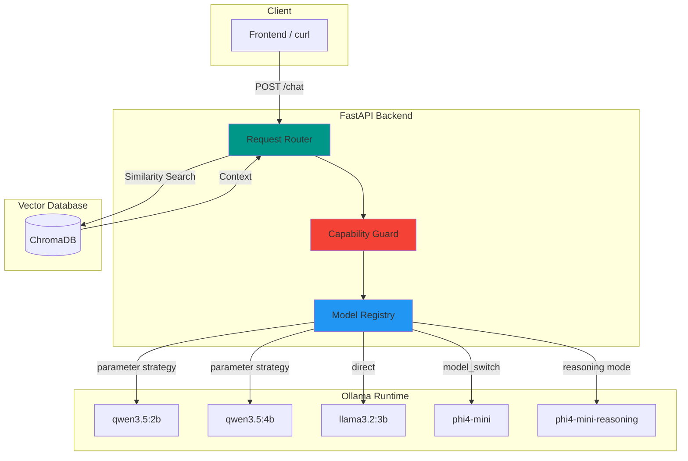

<div align="center">

  <samp>Local AI. Smart Routing. Your Knowledge.</samp>
  <br><br>

  

</div>

> A local-first RAG knowledge assistant with dynamic model routing, capability guards, and multi-model support — powered by Ollama.

[](https://www.python.org/downloads/)
[](https://fastapi.tiangolo.com/)
[](https://ollama.com/)
[](https://opensource.org/licenses/MIT)

[繁體中文](README.zh-TW.md) | [日本語](README.ja.md)

---

## Overview

RAG-Kura is a local-first knowledge assistant backend built with FastAPI and Ollama. It features a **Model Registry** that enables intelligent request routing — automatically selecting the right model variant, injecting parameters, and guarding against unsupported capabilities — all without manual intervention.

## Key Features

- **Retrieval-Augmented Generation (RAG)** — Integrates ChromaDB to answer questions based on local document knowledge
- **Model Registry** — Centralized capability declarations for all registered models
- **Vision Guard** — Automatically rejects image requests sent to text-only models (HTTP 400)
- **Dynamic Reasoning Toggle** — Two strategies for chain-of-thought control:
  - `parameter` — Inject stop tokens to suppress `<think>` blocks
  - `model_switch` — Swap to a dedicated reasoning variant at runtime
- **Local-first** — All inference and embedding runs on your machine locally, no cloud API required
- **Extensible** — Add new models by editing a single dictionary

## System Architecture



## Registered Models

| Model | Vision | Reasoning Strategy | Notes |
|-------|--------|--------------------|-------|
| `qwen3.5:2b` | ✅ | `parameter` | Stop token injection to toggle `<think>` |
| `qwen3.5:4b` | ✅ | `parameter` | Same as above (default model) |
| `llama3.2:3b` | ❌ | `none` | No reasoning toggle |
| `phi4-mini` | ❌ | `model_switch` | Swaps to `phi4-mini-reasoning` |

## Prerequisites

- Python 3.12+
- [Ollama](https://ollama.com/) installed with required models pulled

## Local Development

```bash
# Clone and setup
git clone https://github.com/mile-chang/rag-kura.git
cd rag-kura

# Create virtual environment and install dependencies
python3 -m venv .venv
source .venv/bin/activate
pip install -r requirements.txt

# Ingest Knowledge Base (Optional)
# Place Markdown files in the docs/ directory, then run:
python ingest.py

# Start the server
uvicorn main:app --reload --host 0.0.0.0 --port 8000
# → http://localhost:8000
```

## Deployment

> Coming soon.

## Roadmap

- [x] Phase 1: Environment Setup & SSD Optimization
- [x] Phase 2: AI Backend Foundation (FastAPI & Ollama)
- [x] Phase 3: Vector Database & Document Processing (Local ChromaDB)
- [x] Phase 4: RAG Core Logic Integration (Retriever & Generator)
- [ ] Phase 5: Streamlit Frontend Interface
- [ ] Phase 6: Containerization & Deployment (Docker Compose, CI/CD)

For detailed tasks, please refer to `TODO.md`.

## API Endpoints

| Method | Endpoint | Description |
|--------|----------|-------------|
| POST | `/chat` | Send a message with model selection & reasoning toggle |
| GET | `/health` | Liveness probe; returns registered model list |

### Request Format

```json
{
  "message": "What is RAG?",
  "base_model": "qwen3.5:4b",
  "use_reasoning": false,
  "has_image": false
}
```

### Response Format

```json
{
  "model": "qwen3.5:4b",
  "response": "RAG stands for Retrieval-Augmented Generation..."
}
```

### Example: curl

```bash
# Basic chat
curl -X POST http://localhost:8000/chat \
  -H "Content-Type: application/json" \
  -d '{"message": "Hello, who are you?"}'

# Enable reasoning mode
curl -X POST http://localhost:8000/chat \
  -H "Content-Type: application/json" \
  -d '{"message": "Explain quantum computing", "use_reasoning": true}'

# Health check
curl http://localhost:8000/health
```

## Project Structure

```
rag-kura/
├── main.py              # FastAPI app with routing & capability guards
├── ingest.py            # Knowledge ingestion script (Markdown -> ChromaDB)
├── prompts.py           # System prompt templates
├── tools.py             # External tool definitions (Web Search, Weather, etc.)
├── docs/                # Directory for Markdown files to be ingested
├── chroma_db/           # ChromaDB vector store (gitignored)
├── requirements.txt     # Pinned Python dependencies
├── .gitignore           # Security-aware ignore rules
├── .venv/               # Virtual environment (gitignored)
├── README.md            # Documentation (English)
├── README.zh-TW.md      # Documentation (繁體中文)
└── README.ja.md         # Documentation (日本語)
```

## Tech Stack

| Layer | Technology |
|-------|------------|
| Backend | FastAPI, Pydantic, Uvicorn |
| RAG | LangChain, HuggingFaceEmbeddings, ChromaDB |
| Inference | Ollama (local LLM runtime) |
| Models | Qwen 3.5, LLaMA 3.2, Phi-4 Mini, bge-small-zh-v1.5 |

## Security

- Environment-based secrets via `.env` (gitignored)
- Database files excluded from version control (`*.db`, `*.sqlite`)
- SSL certificates and private keys excluded (`*.pem`, `*.key`)
- Upload directories excluded to prevent sensitive data leakage

## License

This project is licensed under the MIT License - see the [LICENSE](LICENSE) file for details.
