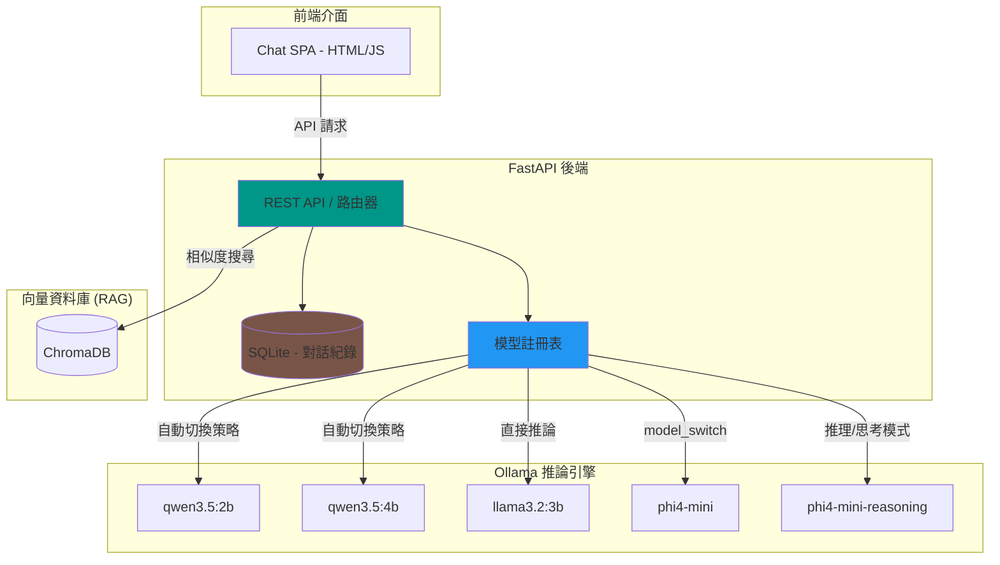

<div align="center">

  <samp>本地 AI。智慧路由。你的知識庫。</samp>
  <br><br>

  <a href="https://github.com/mile-chang/rag-kura">
    
  </a>

</div>

> 一個本地優先的 RAG 知識庫助理，支援動態模型路由、能力防呆與多模型切換 — 由 Ollama 驅動。

[](https://www.python.org/downloads/)
[](https://fastapi.tiangolo.com/)
[](https://ollama.com/)
[](https://opensource.org/licenses/MIT)

[English](README.md) | [日本語](README.ja.md)

---

## 概述

RAG-Kura 是一個以本地推論為核心的知識庫助理後端，使用 FastAPI 與 Ollama 建構。它透過 **模型註冊表 (Model Registry)** 實現智慧請求路由 — 自動選擇正確的模型變體、注入參數、並攔截不支援的能力請求 — 無需手動介入。

## 核心功能

- **檢索增強生成 (RAG)** — 整合 ChromaDB 向量資料庫，基於本地文件進行問答
- **現代化聊天介面 (SPA)** — 使用 HTML/CSS/JS 打造的單頁式應用，支援多對話管理
- **中斷/停止生成** — 支援即時停止模型回應，提升使用體驗
- **思考模式 (Thinking Mode)** — 針對推理模型提供專屬開關，支援 `parameter` 與 `model_switch` 策略
- **智慧負載提示** — 自動檢測模型是否載入 GPU，並提供「正在載入引擎」的溫馨提示
- **對話持久化** — 使用 SQLite 儲存對話紀錄，支援標題自動生成與手動編輯
- **模型註冊表** — 集中式模型能力宣告，所有路由決策的單一來源
- **安全性與防呆** — 自動拒絕不支援的能力請求（如無視覺模型請求圖片）

## 系統架構



## 支援模型 (Ollama)

本專案針對不同模型的推論特性進行了優化配置：

| 模型 | 推理策略 | 備註 |
|------|---------|------|
| [**qwen3.5:2b**](https://ollama.com/library/qwen3.5) | `parameter` | 透過參數注入支援 `Think` 模式切換 |
| [**qwen3.5:4b**](https://ollama.com/library/qwen3.5) | `parameter` | 同上 |
| [**llama3.2:3b**](https://ollama.com/library/llama3.2) | `none` | 標準對話模型，無推理切換 |
| [**phi4-mini**](https://ollama.com/library/phi4-mini) | `model_switch` | 推理時自動切換至 `phi4-mini-reasoning` |

## 前置需求

- Python 3.12+
- [**Ollama**](https://ollama.com/) 已安裝，且所需模型已下載
- **PyTorch (CPU 版本)**：預設使用 CPU 以節省顯存供 Ollama 使用；若您的 VRAM 充足，亦可手動處理為 GPU 版本。

## 本地開發

```bash
# 複製專案並設定
git clone https://github.com/mile-chang/rag-kura.git
cd rag-kura

# 建立虛擬環境並安裝依賴
python3 -m venv .venv
source .venv/bin/activate

# 💡 資源規劃：預設安裝 CPU 版以節省顯存（VRAM），若顯存充足可略過此行直接 install -r
pip install torch --index-url https://download.pytorch.org/whl/cpu
pip install -r requirements.txt

# 匯入知識庫 (可選)
# 將 Markdown 檔案放入 docs/ 資料夾，然後執行：
python ingest.py

# 啟動伺服器
uvicorn main:app --reload --host 0.0.0.0 --port 8000
# 瀏覽器打開：http://localhost:8000
```

## 開發藍圖 (Roadmap)

- [x] Phase 1: 環境建置與 SSD 空間優化
- [x] Phase 2: 架設 AI 大腦與 FastAPI 基礎結構
- [x] Phase 3: 向量資料庫與文件處理 (ChromaDB 本地化實作)
- [x] Phase 4: RAG 核心邏輯大串接 (檢索、文本生成)
- [x] Phase 5: 現代化聊天介面 (Custom SPA 實作)
- [ ] Phase 6: 容器化與自動化部署 (Docker Compose)

詳細待辦事項請參考 `TODO.md`。

## API 端點 (RESTful)

| 方法 | 端點 | 說明 |
|------|------|------|
| GET | `/api/conversations` | 取得對話清單 |
| POST | `/api/conversations` | 建立新對話 |
| GET | `/api/conversations/{id}` | 取得對話詳細內容與歷史 |
| DELETE | `/api/conversations/{id}` | 刪除對話 |
| PATCH | `/api/conversations/{id}/title` | 修改對話標題 |
| POST | `/api/conversations/{id}/messages`| 發送訊息 (支援模型切換與推理) |
| GET | `/api/models/check_loaded` | 檢查模型是否已載入 GPU |

## 專案結構

```
rag-kura/
├── main.py              # FastAPI 核心應用程式與傳輸路由
├── database.py          # SQLite 對話持久化邏輯
├── chat_history.db      # SQLite 資料庫檔案 (已排除版控)
├── ingest.py            # 知識庫寫入腳本
├── prompts.py           # 系統提示詞範本
├── tools.py             # 外部工具定義
├── static/              # 前端靜態資源 (index.html, script.js)
├── docs/                # 存放待匯入的 Markdown 檔案
├── chroma_db/           # ChromaDB 向量庫 (已排除版控)
├── requirements.txt     # Python 依賴
├── README.zh-TW.md      # 繁體中文文件
└── TODO.md              # 發展規劃
```

## 技術堆疊

| 分類 | 技術 / 模型 | 說明 |
|------|------------|------|
| **聊天介面** | Vanilla JS, Tailwind CSS | 現代化 SPA、支援生成中斷與對話持久化 |
| **後端核心** | FastAPI, SQLite | 支援異步推論、動態路由與 Client 隔離 |
| **知識檢索 (RAG)** | LangChain, ChromaDB | 本地向量資料庫、支援 Markdown 知識庫 |
| **向量化模型** | [**bge-small-zh-v1.5**](https://huggingface.co/BAAI/bge-small-zh-v1.5) | **CPU 運行**，SOTA 中文嵌入技術，省下 VRAM |
| **推論引擎** | [**Ollama**](https://ollama.com/) | 本地模型推論 (支援 GPU 加速運算) |

## 安全性

- 透過 `X-Client-ID` 實現瀏覽器層級的對話隔離
- 對話標題編輯限制長度 (100字) 並由後端過濾
- 禁止未授權的檔案路徑訪問

## 授權條款

本專案採用 MIT 授權條款 — 詳見 [LICENSE](LICENSE) 檔案。
