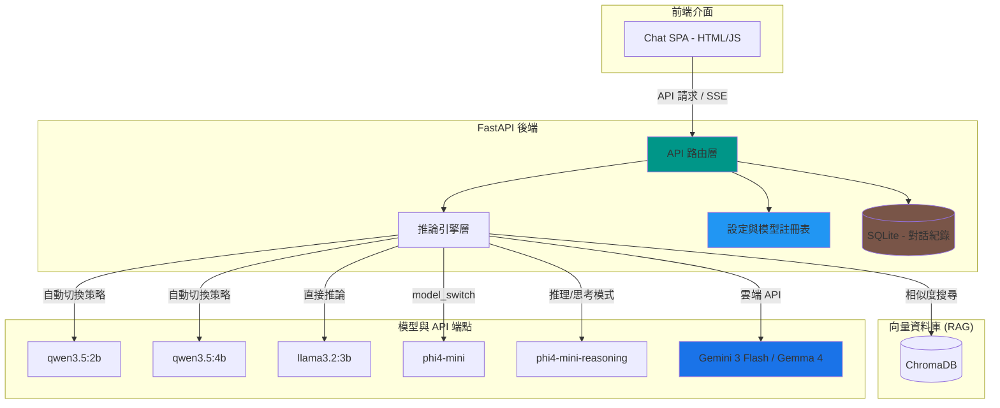

<div align="center">

  <samp>本地 AI。智慧路由。你的知識庫。</samp>
  <br><br>

  <a href="https://github.com/mile-chang/rag-kura">
    
  </a>

</div>

> 一個混合式 RAG 知識庫助理，支援動態模型路由、能力防呆與多供應商切換 — 由 Ollama 與 Google Gemini 驅動。

[](https://www.python.org/downloads/)
[](https://fastapi.tiangolo.com/)
[](https://ollama.com/)
[](https://aistudio.google.com/)
[](https://opensource.org/licenses/MIT)

[English](README.md) | [日本語](README.ja.md)

---

## 概述

RAG-Kura 是一個支援本地與雲端混合推論的知識庫助理後端，使用 FastAPI、Ollama 與 Google Gemini 建構。它透過 **模型註冊表 (Model Registry)** 實現智慧請求路由 — 自動從本地或雲端設備選擇正確的模型變體、注入參數、並攔截不支援的能力請求 — 無需手動介入。

## 核心功能

- **混合式 AI 路由**：無縫切換本地端 (Ollama) 與雲端 (Gemini) 模型，內建能力防呆與自動攔截。
- **檢索增強生成 (RAG)**：結合 ChromaDB 與 CPU 優化之嵌入模型，讓 AI 根據本地文件精準問答。
- **動態思考模式 (Thinking Mode)**：專屬推理切換按鈕，搭配可優雅收合的 `<think>` 思考過程 UI。
- **無縫訪客體驗**：免登入即刻開聊！內建防呆保護與垃圾回收機制，註冊後對話紀錄將自動綁定。
- **現代化響應式介面 (SPA)**：基於 Tailwind CSS 打造，支援桌面端迷你側邊欄與手機版自動收合功能。
- **即時串流與工具調用**：支援 SSE 即時字元生成，並具備聯網搜尋等外部工具即時調用能力。

## 系統架構



## 支援的供應商與模型

RAG-Kura 提供了一個靈活的抽象層，能夠同時支援本地端 (Ollama) 與雲端 (Gemini) 的後端：

### 本地端 (Ollama)
| 模型 | 推理策略 | 備註 |
|------|---------|------|
| [**qwen3.5:2b**](https://ollama.com/library/qwen3.5) | `parameter` | 透過參數注入支援 `Think` 模式切換 |
| [**qwen3.5:4b**](https://ollama.com/library/qwen3.5) | `parameter` | 同上 |
| [**llama3.2:3b**](https://ollama.com/library/llama3.2) | `none` | 標準對話模型，無推理切換 |
| [**phi4-mini**](https://ollama.com/library/phi4-mini) | `model_switch` | 推理時自動切換至 `phi4-mini-reasoning` |

### 雲端 (Google Gemini)
| 模型 | 推理策略 | 備註 |
|------|---------|------|
| **Gemini 3 Flash** | `thinking_level` | 極速雲端常規對話路由（支援推理） |
| **Gemma 4 31B** | `thinking_level_optional` | 透過 Gemini API 調用的大型推理模型 |

## 前置需求

- Python 3.12+
- [**Ollama**](https://ollama.com/) 已安裝，且所需模型已下載（若純粹依靠雲端 Gemini 推理則為可選）。
- [**Google Gemini API Key**](https://aistudio.google.com/apikey)（若純粹依靠本地 Ollama 則為可選）。
- **PyTorch (CPU 版本)**：預設使用 CPU 以節省顯存供 Ollama 使用；若您的 VRAM 充足，亦可手動處理為 GPU 版本。

## 本地開發

```bash
# 複製專案並設定
git clone https://github.com/mile-chang/rag-kura.git
cd rag-kura

# 建立虛擬環境並安裝依賴
python3 -m venv .venv
source .venv/bin/activate

# 💡 資源規劃：預設安裝 CPU 版以節省顯存（VRAM），若顯存充足可略過此行直接 install -r
pip install torch --index-url https://download.pytorch.org/whl/cpu
pip install -r requirements.txt

# 環境設定
cp .env.example .env
# 請編輯 .env 檔案並設定您的 GEMINI_API_KEY (雲端模型) 與 JWT_SECRET_KEY (認證金鑰)

# 匯入知識庫 (可選)
# 將 Markdown 檔案放入 docs/ 資料夾，然後執行：
python ingest.py

# 啟動伺服器
uvicorn main:app --reload --host 0.0.0.0 --port 8000
# 瀏覽器打開：http://localhost:8000
```

## 開發藍圖 (Roadmap)

- [x] Phase 1: 環境建置與 SSD 空間優化
- [x] Phase 2: 架設 AI 大腦與 FastAPI 基礎結構
- [x] Phase 3: 向量資料庫與文件處理 (ChromaDB 本地化實作)
- [x] Phase 4: RAG 核心邏輯大串接 (檢索、文本生成)
- [x] Phase 5: 現代化聊天介面 (Custom SPA 實作)
- [ ] Phase 6: 容器化與自動化部署 (Docker Compose)

詳細待辦事項請參考 `TODO.md`。

## API 端點 (RESTful)

| 方法 | 端點 | 說明 |
|------|------|------|
| POST | `/api/users` | 註冊新使用者帳號 |
| POST | `/api/sessions` | 登入並發放 JWT (自動合併訪客歷史紀錄) |
| GET | `/api/users/me` | 取得當前登入的使用者資訊 |
| GET | `/api/conversations` | 取得對話清單 |
| POST | `/api/conversations` | 建立新對話 |
| GET | `/api/conversations/{id}` | 取得對話詳細內容與歷史 |
| DELETE | `/api/conversations/{id}` | 刪除對話 |
| PATCH | `/api/conversations/{id}/title` | 修改對話標題 |
| POST | `/api/conversations/{id}/messages`| 發送訊息 (支援模型切換與推理) |
| POST | `/api/upload` | 上傳並解析知識庫文件 |
| GET | `/api/models/{id}/status` | 檢查模型是否已載入 VRAM / 連線正常 |
| GET | `/api/status` | 取得供應商 (Ollama/Gemini) 狀態與模型清單 |

## 專案結構

```
rag-kura/
├── main.py              # 應用程式進入點與靜態檔案路由
├── config.py            # 應用程式設定與模型註冊表
├── schemas.py           # Pydantic 資料模型
├── api/                 # FastAPI HTTP 路由介面層
├── inference/           # 推論引擎與 SSE 串流產生器
├── database.py          # SQLite 對話持久化邏輯
├── chat_history.db      # SQLite 資料庫檔案 (已排除版控)
├── ingest.py            # 知識庫寫入腳本
├── prompts.py           # 系統提示詞範本
├── tools.py             # 外部工具定義
├── static/              # 前端靜態資源 (index.html, script.js)
├── docs/                # 存放待匯入的 Markdown 檔案
├── chroma_db/           # ChromaDB 向量庫 (已排除版控)
├── requirements.txt     # Python 依賴
├── README.zh-TW.md      # 繁體中文文件
└── TODO.md              # 發展規劃
```

## 技術堆疊

| 分類 | 技術 / 模型 | 說明 |
|------|------------|------|
| **聊天介面** | Vanilla JS, Tailwind CSS | 現代化 SPA、支援生成中斷與對話持久化 |
| **後端核心** | FastAPI, SQLite | 支援異步推論、動態路由與 Client 隔離 |
| **知識檢索 (RAG)** | LangChain, ChromaDB | 本地向量資料庫、支援 Markdown 知識庫 |
| **向量化模型** | [**bge-small-zh-v1.5**](https://huggingface.co/BAAI/bge-small-zh-v1.5) | **CPU 運行**，SOTA 中文嵌入技術，省下 VRAM |
| **安全性** | PyJWT, bcrypt | 無狀態 JWT 認證與安全的密碼雜湊 |
| **推論引擎** | [**Ollama**](https://ollama.com/) / **Google Gemini** | 混合式地端與雲端模型推論引擎 (支援 Tool Calling 邏輯) |

## 安全性

- 透過 `X-Client-ID` 實現瀏覽器層級的對話隔離
- 對話標題編輯限制長度 (100字) 並由後端過濾
- 禁止未授權的檔案路徑訪問

## 授權條款

本專案採用 MIT 授權條款 — 詳見 [LICENSE](LICENSE) 檔案。
