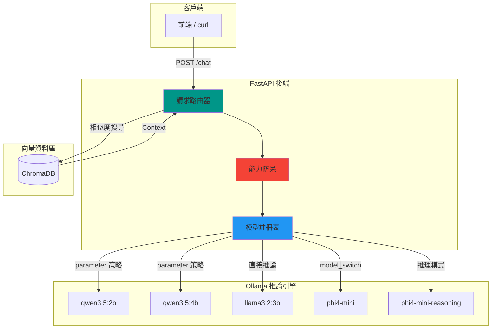

<div align="center">

  <samp>本地 AI。智慧路由。你的知識庫。</samp>
  <br><br>

  

</div>

> 一個本地優先的 RAG 知識庫助理，支援動態模型路由、能力防呆與多模型切換 — 由 Ollama 驅動。

[](https://www.python.org/downloads/)
[](https://fastapi.tiangolo.com/)
[](https://ollama.com/)
[](https://opensource.org/licenses/MIT)

[English](README.md) | [日本語](README.ja.md)

---

## 概述

RAG-Kura 是一個以本地推論為核心的知識庫助理後端，使用 FastAPI 與 Ollama 建構。它透過 **模型註冊表 (Model Registry)** 實現智慧請求路由 — 自動選擇正確的模型變體、注入參數、並攔截不支援的能力請求 — 無需手動介入。

## 核心功能

- **檢索增強生成 (RAG)** — 整合 ChromaDB 向量資料庫，基於本地文件進行問答
- **模型註冊表** — 集中式模型能力宣告，所有路由決策的單一來源
- **視覺能力防呆** — 自動拒絕將圖片請求發送至純文字模型（HTTP 400）
- **動態推理切換** — 兩種思考鏈控制策略：
  - `parameter` — 注入停止標記以抑制 `<think>` 區塊
  - `model_switch` — 在執行時切換至專用推理模型
- **本地優先** — 所有推論與 Embedding 均透過本地執行，無需雲端 API
- **易於擴展** — 新增模型只需編輯一個字典

## 系統架構



## 已註冊模型

| 模型 | 視覺 | 推理策略 | 備註 |
|------|------|---------|------|
| `qwen3.5:2b` | ✅ | `parameter` | 透過停止標記切換 `<think>` |
| `qwen3.5:4b` | ✅ | `parameter` | 同上（預設模型） |
| `llama3.2:3b` | ❌ | `none` | 無推理切換 |
| `phi4-mini` | ❌ | `model_switch` | 切換至 `phi4-mini-reasoning` |

## 前置需求

- Python 3.12+
- [Ollama](https://ollama.com/) 已安裝，且所需模型已下載

## 本地開發

```bash
# 複製專案並設定
git clone https://github.com/mile-chang/rag-kura.git
cd rag-kura

# 建立虛擬環境並安裝依賴
python3 -m venv .venv
source .venv/bin/activate
pip install -r requirements.txt

# 匯入知識庫 (可選)
# 將 Markdown 檔案放入 docs/ 資料夾，然後執行：
python ingest.py

# 啟動伺服器
uvicorn main:app --reload --host 0.0.0.0 --port 8000
# → http://localhost:8000
```

## 部署

> 即將推出。

## 開發藍圖 (Roadmap)

- [x] Phase 1: 環境建置與 SSD 空間優化
- [x] Phase 2: 架設 AI 大腦與 FastAPI 基礎結構
- [x] Phase 3: 向量資料庫與文件處理 (ChromaDB 本地化實作)
- [x] Phase 4: RAG 核心邏輯大串接 (檢索、文本生成)
- [ ] Phase 5: Streamlit 前端對話介面
- [ ] Phase 6: 容器化與自動化部署 (Docker Compose, CI/CD)

詳細待辦事項請參考 `TODO.md`。

## API 端點

| 方法 | 端點 | 說明 |
|------|------|------|
| POST | `/chat` | 發送訊息，可選擇模型與推理模式 |
| GET | `/health` | 健康檢查，回傳已註冊模型清單 |

### 請求格式

```json
{
  "message": "什麼是 RAG？",
  "base_model": "qwen3.5:4b",
  "use_reasoning": false,
  "has_image": false
}
```

### 回應格式

```json
{
  "model": "qwen3.5:4b",
  "response": "RAG 是檢索增強生成的縮寫..."
}
```

### 範例：curl

```bash
# 基本聊天
curl -X POST http://localhost:8000/chat \
  -H "Content-Type: application/json" \
  -d '{"message": "你好，你是誰？"}'

# 啟用推理模式
curl -X POST http://localhost:8000/chat \
  -H "Content-Type: application/json" \
  -d '{"message": "解釋量子計算", "use_reasoning": true}'

# 健康檢查
curl http://localhost:8000/health
```

## 專案結構

```
rag-kura/
├── main.py              # FastAPI 應用程式，含路由與能力防呆
├── ingest.py            # 知識庫寫入腳本 (Markdown -> ChromaDB)
├── prompts.py           # 系統提示詞範本
├── tools.py             # 外部工具定義 (Web Search, Weather 等)
├── docs/                # 存放待匯入的 Markdown 檔案
├── chroma_db/           # ChromaDB 向量庫 (已排除版控)
├── requirements.txt     # 鎖定版本的 Python 依賴
├── .gitignore           # 資安導向的忽略規則
├── .venv/               # 虛擬環境（已排除版控）
├── README.md            # 文件（English）
├── README.zh-TW.md      # 文件（繁體中文）
└── README.ja.md         # 文件（日本語）
```

## 技術堆疊

| 層級 | 技術 |
|------|------|
| 後端 | FastAPI, Pydantic, Uvicorn |
| RAG | LangChain, HuggingFaceEmbeddings, ChromaDB |
| 推論 | Ollama（本地 LLM 執行環境） |
| 模型 | Qwen 3.5, LLaMA 3.2, Phi-4 Mini, bge-small-zh-v1.5 |

## 安全性

- 透過 `.env` 管理環境敏感資訊（已排除版控）
- 資料庫檔案排除版控（`*.db`, `*.sqlite`）
- SSL 憑證與私鑰排除版控（`*.pem`, `*.key`）
- 上傳目錄排除版控，防止敏感資料洩漏

## 授權條款

本專案採用 MIT 授權條款 — 詳見 [LICENSE](LICENSE) 檔案。
